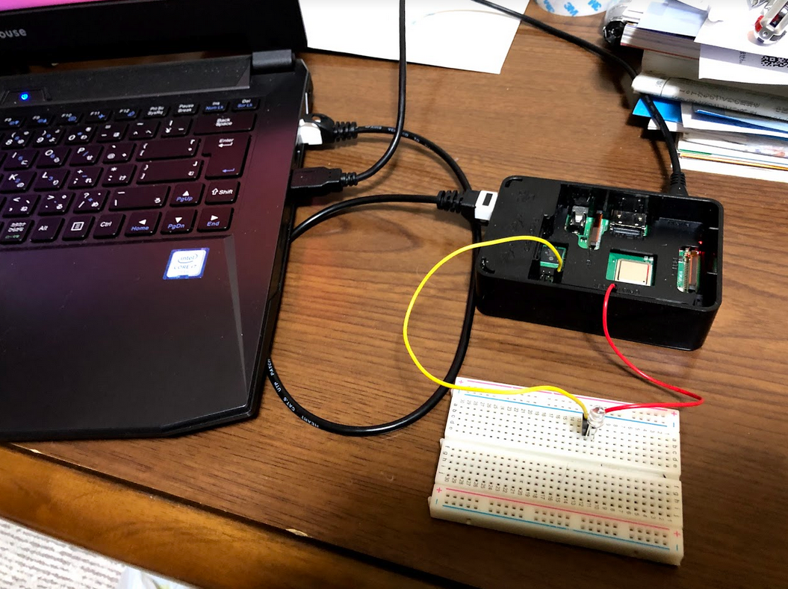

# 2018ロボットシステム学課題1
## 動作説明
 自作デバイスドライバによりRaspberryPi3B+のGPIOを操作することでLEDを点滅させる <p> 
動画

### 動作環境

|||
|:--:|:--:|
|Raspberry Pi|Raspberry Pi Model 3B+|
|OS| Ubuntu16.04|
## 回路説明
* GPIO25とGNDの間にLEDを接続
  * GPIO25: 22番ピン
  * GND: 39番ピン

## インストール方法
```
$ git clone https://github.com/hatakeyamayuta/robosyskadai1.git
$ cd robosyskadai1
$ make
$ ./setup.sh
```
### 実行方法
```
$ echo 1 > /dev/myled0
```
### デバイスドライバのアンインストール
```
$ sudo rmmod myled
```
### 参考文献
* ロボットシステム学2018第8回   
https://github.com/ryuichiueda/robosys2018/blob/master/06.md  
* カーネルモジュール作成によるlinuxカーネル開発入門 - 第二回 一定時間後に処理をする(タイマー)   
https://qiita.com/satoru_takeuchi/items/254dbd7bcad392263c85
